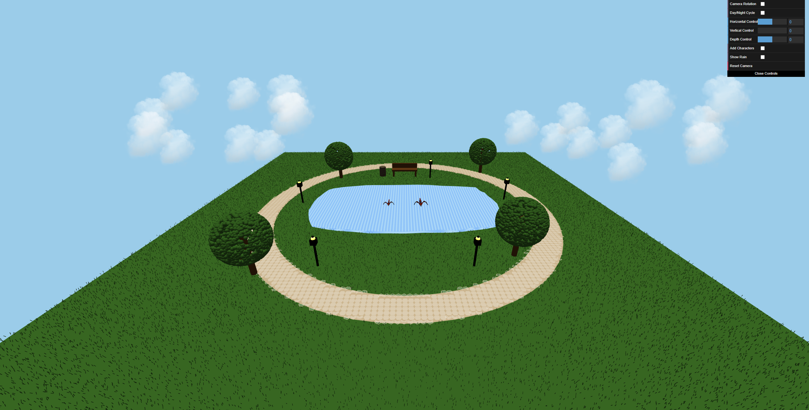
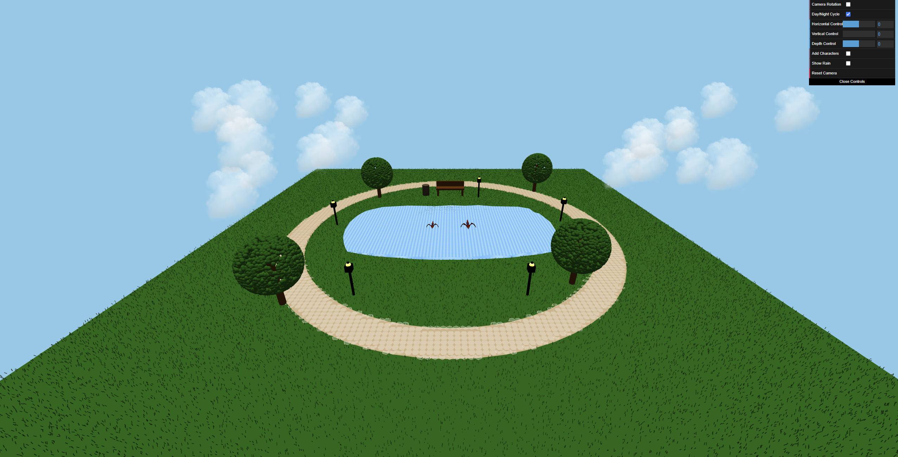
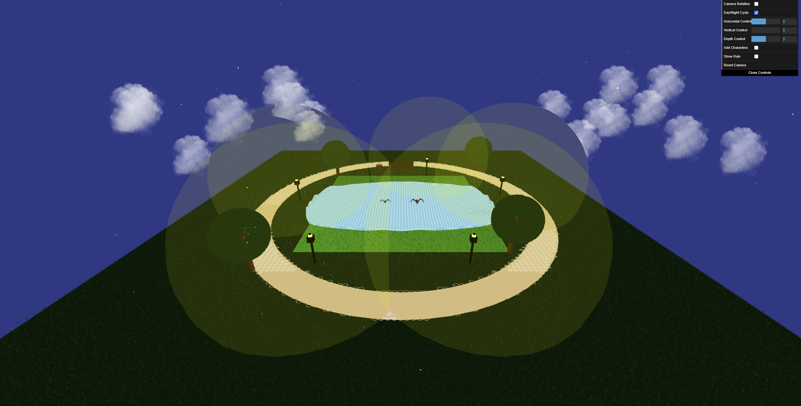
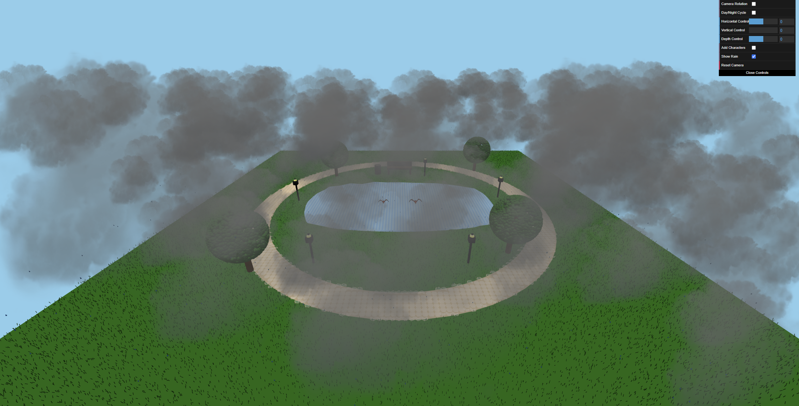
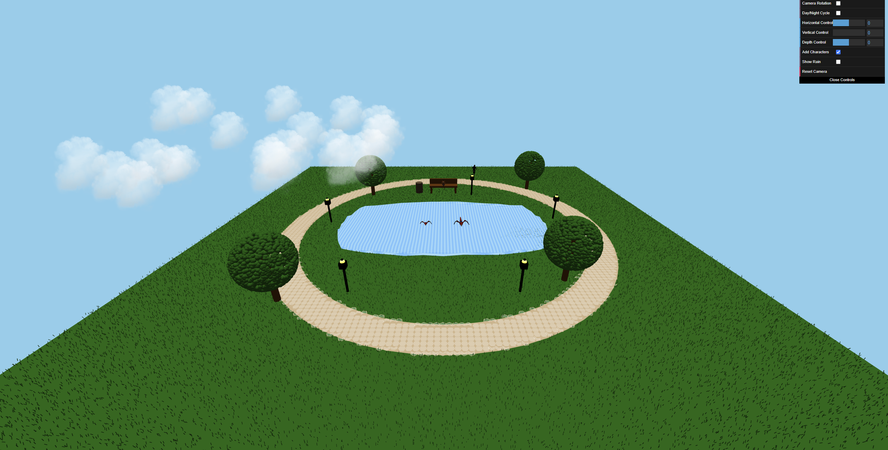

# Natural Park 3D Simulation

## Overview

This project is a **real-time interactive 3D simulation** of a natural park, developed using **Three.js**. It features an engaging 3D world with **dynamic weather conditions, a day-night cycle, interactive elements, and animated entities**. The simulation includes **terrain, trees, a lake, streetlights, benches, and birds**, all of which contribute to a realistic experience. Users can explore the park using **camera controls**, modify scene settings through an interactive **GUI**, and interact with moving elements like birds and characters.

## Features

- **Realistic 3D Environment**: Trees, water reflections, benches, and lighting create a detailed scene.
- **Camera Navigation**: `OrbitControls` allows users to explore the environment smoothly.
- **Weather Effects**: A dynamic rain system modifies the lake’s surface to simulate turbulence.
- **Day/Night Cycle**: The scene transitions smoothly between daytime and nighttime settings.
- **Animated Characters**: Utilizes `running.fbx` and `sitting.fbx` models for realistic movement.
- **Interactive Birds**: Birds on the lake take flight when clicked, following mouse movements, and return upon the next click.
- **Continuous Motion Elements**: Clouds, lighting effects, and animated entities move dynamically within the scene.
- **Customizable Scene**: Users can modify lighting, toggle weather effects, and add characters through the **dat.GUI** panel.

## Technologies Used

- **Three.js** - 3D rendering and scene management.
- **GLTFLoader & FBXLoader** - Loading external 3D models.
- **OrbitControls** - Enables smooth user interaction.
- **dat.GUI** - Provides real-time control of scene elements.
- **WebGLRenderer** - Optimized for real-time rendering performance.

## Project Structure

- `index.html` - The main file that initializes the 3D scene.
- `script.js` - Manages scene setup, animations, and interactivity.
- `models/` - Contains 3D assets:
  - `running.fbx` - Running character animation.
  - `sitting.fbx` - Sitting character animation.
- `textures/` - Collection of surface textures for realism.

## Setup & Running the Project

1. Clone the repository:
   ```bash
   git clone https://github.com/galbinasuana/Natural-Park-ThreeJS.git
   ```
2. Open `index.html` in a modern web browser.
3. Use the GUI controls to interact with the scene.
4. Move characters using **horizontal, vertical, and depth** control sliders.
5. Toggle **Add Characters** to introduce animated entities into the scene.
6. Enable **Show Rain** to activate weather effects, making the lake’s surface more dynamic.

## Preview

The following images represent different aspects of the project. The simulation includes continuous movement elements such as **clouds drifting, the day-night cycle, rainfall effects, and animated characters**.

### Base Scene
This image represents the initial layout of the park with static elements.


### Day/Night Cycle
The environment dynamically transitions between day and night.



### Weather Effects
Rain interacts with the environment, making the lake appear more turbulent.


### Character Interaction
Users can add animated characters that move and interact within the scene.
